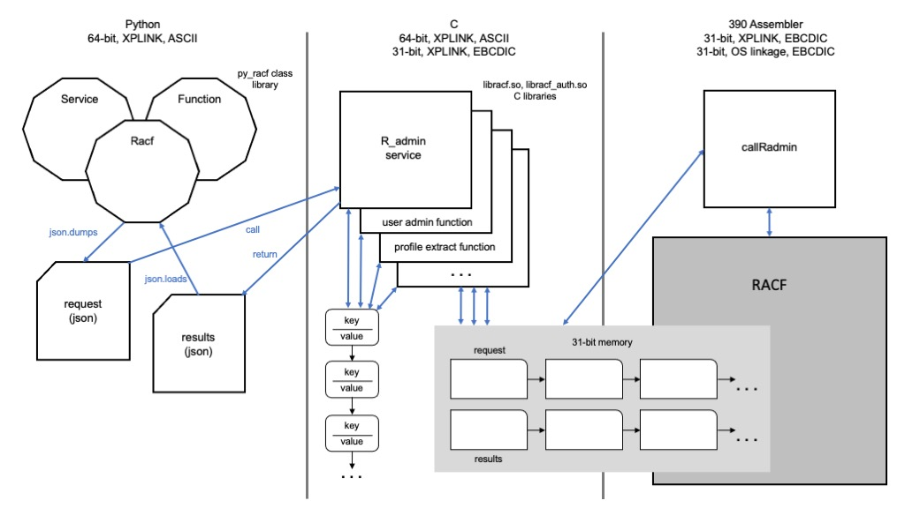

# py_racf
A Python interface to the library of services provided by RACF

The IBM Resource Access Control Facility (RACF) is the primary facility for
managing identity, authority, and access control for z/OS.  There are more 
than 50 callable services with assembler interfaces that are part of the
RACF API.  The complete set of interfaces can be found at 

[http://publibz.boulder.ibm.com/epubs/pdf/ich2d112.pdf](http://publibz.boulder.ibm.com/epubs/pdf/ich2d112.pdf)

Each callable service implements several functions, making this RACF interface
very broad and deep.

This code navigates the transition from a Python environment to RACF and back.  
These are the key environmental characteristics that require conversions, or
marshalling of data from one form to another:
- _**Addressing mode (AMODE)**_.  Python runs in a 64-bit address space, as 
many z/OS components and applications do.  RACF uses 31-bit memory.
- _**Linkage and register conventions**_.  Most z/OS applications created over
the last several years make use of eXtra Performance linkage (XPLINK).  This
outlines call stack management, register conventions, and other runtime practices 
that enable programs to communicate.  Python is an XPLINK application, while RACF
follows OS linkage conventions.
- _**Text encoding**_.  Python's default encoding is usually UTF-8, and for our
purposes we will live withing the 7-bit ASCII subset (ISO8859-1).  RACF speaks
EBCDIC (IBM-037).
- _**Data forms**_.  Py_racf provides results as a conventional Python
dictionary.  The interface for calling and passing control to RACF is through a
class library to make the RACF interaction as Pythonic as possible.  RACF
understands in-memory control blocks that are chanined together using addresses
and offsets.

## An Extensible Framework
This project is intended to be an extensiable exanmple of how to call from an
open source language to a z/OS component or subsystem.  It contains plug points
that make it relatively easy to build interfaces for other languages.

Although this solution is tailored to the Python environment, the real high
level interface is through a Json file.  This accomplishes two things:
- _**Makes the interface language-agnostic**_.  New languages can use the same
interface by creating a Json file with the request, and consuming the results in 
Json form.
- _**Avoids enviromental limitations**_.  Pipes are often used to communicate
between components of a framework like this one.  Depending on the platform
configuration, they may overflow.  This is a problem we encountered with an 
earlier implmentation of py_racf.  By using temp files for input and output, we
can avoid this scenario.

## Marshalling Data
The RACF assembler API is an incredibly detailed and flexible interface that
accomodates a wide variety of functions.  It is an in-memory interface of control
blocks chained together by addresses and offsets.  It's not feasible to implement a
high-level language (C) interface for each RACF service that works with the unique
control blocks of all its member functions.  

For efficiency purposes, each RACF service translates Json requests to a common
format key-value chain that is passed to all of its member functions.  Conversely,
member functions convert the control block results returned by RACF into a
corresponding key-value chain that the RACF service will marshal back to Json format
for return to Python.  Once in the Python environment, it's simple to load the Json
into a dictionary.

## An Example - R_admin, Profile Extract
The profile extract function of the RACF administration service illlustrates how
data moves from the RACF class in Python, through the C interfaces to the assembler
call stub to the RACF assembler interface (IRRSEQ00).

The profile extract function uses a parameter list mapped by the IRRPCOMP data area.
Py_racf contains a C header that defines this data area, and it is used to both 
pass requests to, and receive results from IRRSEQ00.  This parameter list is part of
an argument list that additionally contains a work area and status information.  RACF
returns results through this argument list, which points to the control block chain
representing the results.  All of these structures reside in 31-bit addressable
memory.

## Punch list
- This thing leaks memory.  There are so many discrete fields and values that are
marshalled between different forms that it's hard to be sure that everything gets
cleaned up properly.  What it needs is a memory manager that tracks all allocations
and garbage collects at the end of a reuqest.  This is a version 2 effort.  It won't
be a problem for apps that make some RACF calls to perform a task and exit, but it
could be an issue for servers in processes that persist for a long period of time.
- The transcoding area could be more robust.  Today it handles trancoding between 
ISO8859-1 (US 7-bit ASCII), and IBM-037 (EBCDIC).  This should be updated for full
UNICODE support.
- Some attempt has been made to implement basic encapsulation in the C code to isolate
structure access to a set of associated methods.  It's not as consistently implemented
as it should be.  See the keyval code as an example.
- Implement the printable ASCII text section of the dump_mem() utility.
